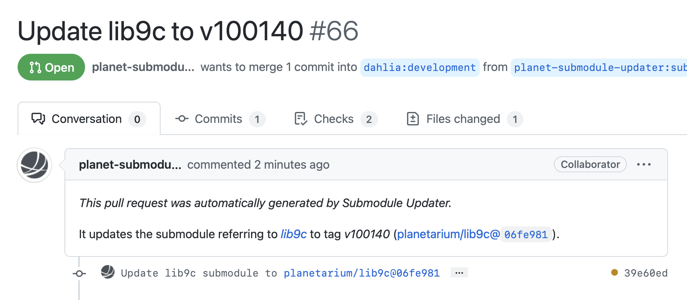

Submodule Updater
=================

Submodule Updater is a GitHub action (and also is a CLI program) that lets
repositories keep up to date with their submodules.  It's similar to
[Dependabot], but for submodules instead of package dependencies.

Unlike Dependabot which follows periodical pull model, it follows event-driven
push model.  It's installed in repositories to be referred as submodules,
instead of repositories that have submodules.[^1]

In its typical scenario, it's triggered by tag pushes on a submodule repository
and then it opens pull requests to update submodule head refs to dependent
repositories.  (It may rather push commits rather than opening pull requests
in certain cases.[^2])

[^1]: The decision behind this is basically because it's way easier to build
      a GitHub action than a regular GitHub app, which usually requires
      a running sever.  However, we believe it works well with Git submodules,
      as submodules are usually linked between repositories maintained by
      the same organization.

[^2]: If the Submodule Updater is allowed to push to the dependent repository,
      and there are no changes in the source tree level (i.e., the previous
      commit and the new commit share the same tree hash in Git) from
      the submodule repository, it tries to directly push an updating commit
      to the dependent repository.

[Dependabot]: https://github.com/dependabot

Usage
-----

It's intended to be mainly used in GitHub Actions workflows.  (It can be
manually invoked as a CLI program on your terminal though.)

~~~ yaml
- uses: planetarium/submodule-updater@main
  if: github.ref_type == 'tag'
  with:
    token: ${{ secrets.GH_PAT }}  # PAT of a bot account on GitHub
    committer: "Submodule Updater <bot@example.com>"
    targets: |
      org/repo:branch
      org/foo:master
      org/bar:main
~~~

You can customize the pull request template:

~~~ yaml
- uses: planetarium/submodule-updater@main
  if: github.ref_type == 'tag'
  with:
    token: ${{ secrets.GH_PAT }}  # PAT of a bot account on GitHub
    committer: "Submodule Updater <bot@example.com>"
    # Note that below messages are just default settings:
    pr-title: "Update {submodule_repository.name} to {submodule_ref_name}"
    pr-description: >
      *This pull request was automatically generated by Submodule Updater.*

      It updates the submodule referring to
      [*{submodule_repository.name}*]({submodule_repository.html_url}) to
      {submodule_ref_type} *{submodule_ref_name}*
      ({submodule_repository.full_name}@{submodule_commit.sha}).

    # Available variables in format strings:
    #   submodule_repository: github3.repos.Repository
    #   submodule_repository.name: str       # e.g. libplanet
    #   submodule_repository.full_name: str  # e.g. planetarium/libplanet
    #   submodule_ref: github3.git.Reference
    #   submodule_ref.ref: str               # e.g., refs/tags/1.2.3
    #   submodule_ref_type: Optional[str]    # e.g., tag
    #   submodule_ref_name: str              # e.g., 1.2.3
    #   submodule_commit: github3.git.GitObject
    #   submodule_commit.sha: str
~~~

CLI
---

*Needs to be documented further.*

It basically follows the ordinary architecture of Python CLI apps.  It requires
recent versions of Python.  I tested it on Python 3.9 and 3.10.  It may work
on older versions, but I'm not sure.

First of all, you probably need an isolated virtualenv:

~~~ bash
python3 -m venv .venv
source .venv/bin/activate
~~~

You can install the dependencies using the latest pip:

~~~ bash
pip3 install -e .
~~~

The root package `sur` has its own main function.  It's a simple CLI app
that consists of only a single command.  Try `--help` to get started:

~~~ bash
python3 -m sur --help
~~~

Known issues
------------

### Submodules should be referred by URLs public available

Submodule Updater currently fails to update submodules in target repositories
when their URLs are not publicly accessible.  You can see the submodule URLs in
*.gitmodules* file.  Check if these URLs can be cloned *without any
authentication* including SSH keys.

Note that GitHub's SSH URLs (which start with `git@github.com:` and end with
`.git`) do not allow unauthenticated clients to clone them *even for public
repositories*.  You usually use HTTPS URLs instead (which start with
`https://github.com/` and end with `.git`).

The only workaround as of now is to update submodule URLs.  You can change them
using [`git submodule set-url` command][git submodule set-url].  Don't miss
committing changes either.

[git submodule set-url]: https://git-scm.com/docs/git-submodule#Documentation/git-submodule.txt-set-url--ltpathgtltnewurlgt
